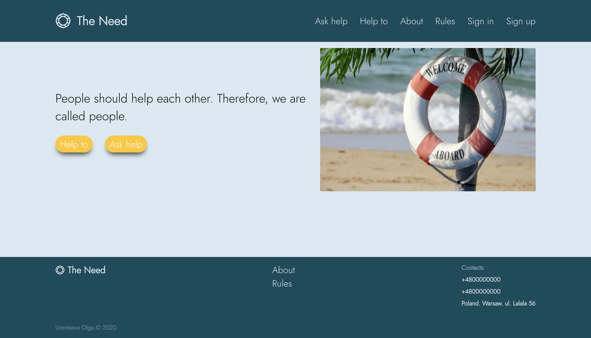
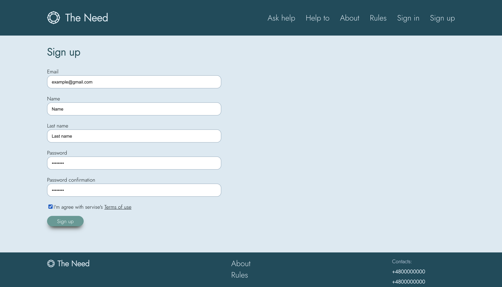
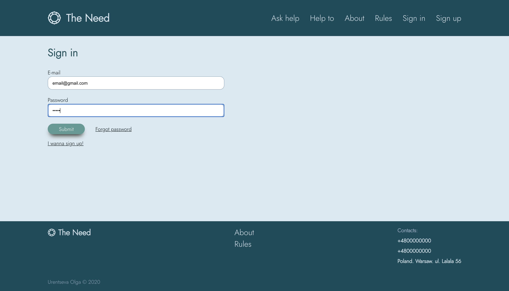
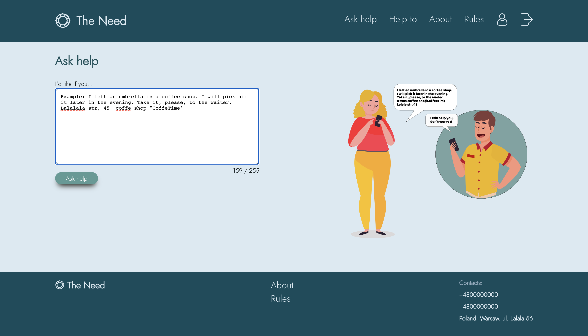
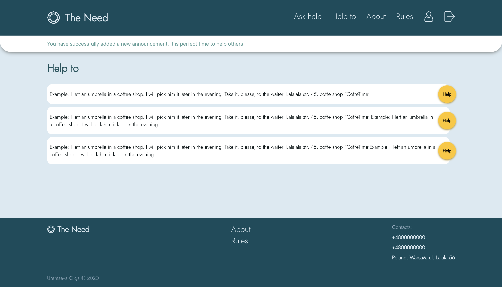
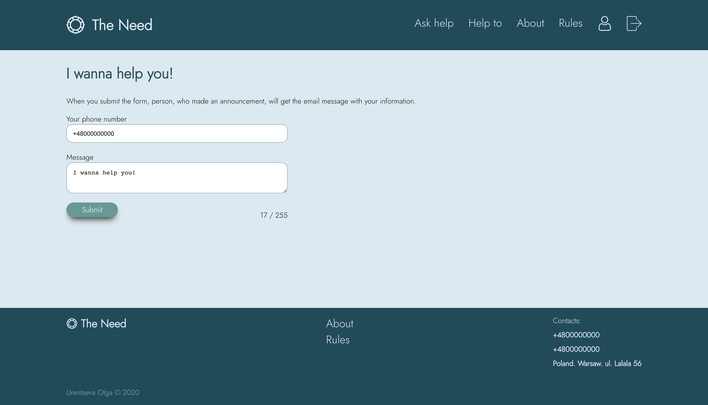

# The Need

The Need is a website for placement and response to help announcements

## Launching

Clone repository:

```bash
git clone git@github.com:olga-urentseva/need.git
```

In this project we use [yarn](https://classic.yarnpkg.com/en/docs/install/#mac-stable) as a package manager. So install the dependencies with it:

```bash
yarn
```

To work with the database, the application needs the database. If you wanna to do it quiqkly, you can run the postgress in Docker (https://docs.docker.com/get-docker/). After installing the Docker, create and run container:

```bash
docker run -d -p 6432:5432 -e POSTGRES_USER='need' -e POSTGRES_PASSWORD='password'  postgres:12.2-alpine
```

Copy the contents from the `.env.example` to `.env` file and fill it with contents.

Run migrations. This will prepare dataabase to run project:

```bash
knex migrate:latest
```

Finally run the application!

```bash
yarn start:dev
```

Now you can open [localhost:3000](http://localhost:3000/) in browser!

## Technologies that I use in this project:

### For backend:

1. Node.js
2. Framework Fastify
3. Plugins fastily-cookie, fastify-flash, fastily-formbody, fastify-secure-session, fastify-static, fastify-point-of-view.
4. Argon 2 for security of users passwords
5. SQL query builder Knex
6. NPM package Mailer for sending emails to users
7. Docker

### For frontend:

1. Pug
2. Sass
3. Javascript

### Used approaches:

1. Mobile first
2. Responsive design
3. Inclusiveness
4. Minimize application weight (for example, I used SVGO for all svg files to make their weight less).

I leverage a MVC pattern to build backend

And some tools for coding like prettier and nodemon.

## Workflow demonstration

The main idea of this project is the ability to post announcements that you need a little help and respond to such announcements if you want to help someone.



After registering and logging into your account you have the opportunity to make an announcement that you need some help.




Or you can help someone right away by selecting the appropriate ad and filling out the form. Information about you will be sent on email to the person who sent the announcement. It is so easy!



Of course, the functionality of the application is not limited to this. You can see more information on using the application in the video.
Or launch it yourself.
